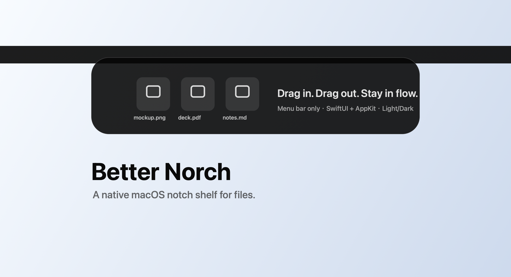

# Better Norch

> A native macOS notch shelf for holding files, moving fast, and staying in flow.



Better Norch is a lightweight macOS menu bar app that turns the top-center notch area into a temporary file shelf. Drag files or folders into the top edge, choose whether to move or copy them into the shelf, then drag them back out to Finder, Desktop, browser upload fields, chat apps, or tools such as Codex.

It is inspired by the interaction style of BoringNotch and the file-holding workflow of Dropover, but keeps the first version intentionally focused: native, small, and easy to extend.

## Why

Sometimes you need to park a file for just a moment: move it between windows, upload it later, collect a few screenshots, or clear your Desktop without losing context. Better Norch gives that action a tiny place at the top of the screen.

## Highlights

- Native macOS app built with Swift, SwiftUI, and AppKit.
- Menu bar utility with no Dock icon.
- Top-center receiver expands on hover or file drag.
- Supports files and folders from Finder.
- Split shelf with two drop zones:
  - `Trans`: moves the original file into Better Norch.
  - `Copy`: copies the file into Better Norch and keeps the original in place.
- Drag items out to Finder, Desktop, upload fields, or other apps.
- Removes an item from the shelf after a successful external drag.
- Double-click an item to open it with `NSWorkspace`.
- Hover an item to reveal a quick trash button.
- Right-click item menu with `Open` and `Move to Trash`.
- Menu bar actions: `Show Shelf`, `Clear Shelf`, and `Quit`.
- Persistent metadata with `UserDefaults` and `Codable`.
- Adaptive light/dark styling.

## Current Behavior

When a file is dropped into the `Trans` zone, the original file is moved into:

```text
~/Library/Application Support/Better Norch/ShelfItems/
```

When a file is dropped into the `Copy` zone, Better Norch copies the file into the same shelf storage directory and leaves the original file where it was.

Dragging an item out provides the stored file URL to the destination. Once the destination accepts the drag, the item is removed from the shelf list. Quick delete and `Clear Shelf` move stored shelf files to the Trash.

## Requirements

- macOS 14.0 or later
- Xcode 16 or later recommended
- Swift 5

Sandbox is intentionally disabled for the MVP because the app moves local files and provides them to other apps through drag and drop.

## Run

Open the project in Xcode:

```bash
open NotchShelf.xcodeproj
```

Select the `NotchShelf` scheme and press Run. The built app is displayed as **Better Norch**.

Or build from Terminal:

```bash
xcodebuild -project NotchShelf.xcodeproj -scheme NotchShelf -configuration Debug build
```

The app appears in the menu bar only. It will not appear in the Dock. Use the menu bar item to enable `Launch at Login` if you want Better Norch to come back automatically after restarting macOS.

## Usage

1. Launch Better Norch.
2. Move the pointer to the top-center notch area to reveal the shelf.
3. Drop files on `Trans` to move originals into the shelf.
4. Drop files on `Copy` to keep originals where they are and shelf a copy.
5. Drag items out to Finder, Desktop, or an upload target when needed.
6. Use the hover trash button or right-click menu to delete a shelved item.
7. Use the menu bar icon for `Show Shelf`, `Clear Shelf`, `Launch at Login`, or `Quit`.

## Project Structure

```text
NotchShelf/
  Menu/       Menu bar status item and menu actions
  Models/     Shelf item data model
  Resources/  App icon and asset catalog
  Services/   File icon, shelf storage, and login item helpers
  Stores/     ShelfStore persistence and item operations
  Views/      SwiftUI panel, drag receiver, visual helpers
  Windows/    Top NSPanel window controller and window state
```

## Implementation Notes

- `NotchWindowController` owns the floating transparent `NSPanel`.
- `DragReceiverView` bridges AppKit drag destination handling into SwiftUI.
- `ShelfPanelView` renders the adaptive notch shelf UI and item interactions.
- `ShelfStore` handles adding, opening, removing, clearing, saving, and loading items.
- `ShelfStorageService` manages app-private file storage and Trash operations.
- `LoginItemService` manages the native macOS Launch at Login registration.

## Roadmap

- Add preferences for shelf size, position, and theme.
- Add import mode: move into shelf or copy into shelf.
- Add multi-screen positioning options.
- Add keyboard shortcuts.
- Add richer animations and file previews.
- Add tests for storage and persistence behavior.
- Package signed `.dmg` releases.

## Known Limitations

- The MVP is not App Store sandbox ready.
- There is no preferences UI yet.
- Release builds are currently unsigned local builds.

## License

MIT. See [LICENSE](LICENSE).
